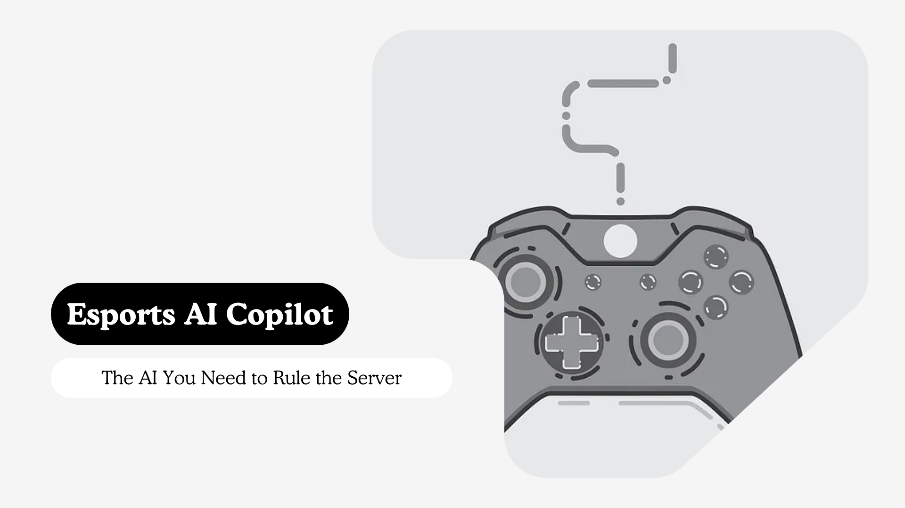
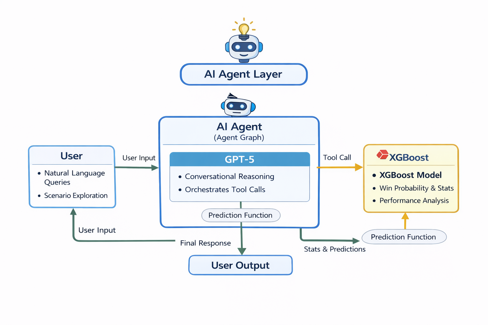
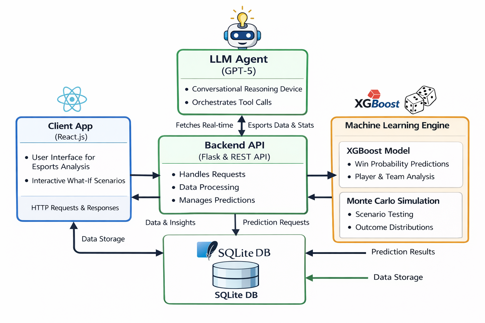

## Esport AI Copilot - Powered by GRID & Cloud9



## Inspiration

🚀 Esports is exploding in scale, but decision-making is still mostly manual and slow. Coaches/analysts rely on VODs, scattered dashboards, and intuition — even though a single round can decide a match. A typical series produces thousands of micro-events (kills, assists, economy, weapons) 🤯, yet most insights arrive after the match, when it’s too late to act.

⏱️ The core issue isn’t lack of data — it’s lack of real-time understanding. Humans can’t process live signals like kill-diff trends, headshot ratios, economy efficiency, weapon impact, consistency drops fast enough. This causes missed patterns (eco failures, rifle dependency, poor trading), and fans struggle because matches feel confusing without instant explanations😕.

🤖 This inspires the need for an AI Esports Agent — not just a prediction model, but a system that turns live stats into instant intelligence 💡. It can detect momentum shifts, explain win signals, compare team styles, and run what-if simulations (role swaps, weapon ratio changes) to show how decisions affect outcomes🔮.

🏆 Ultimately, esports has become too fast + too complex for human-only analysis. Teams need decision support at match speed, fans need real storytelling backed by stats 📊, and tournaments need scalable intelligence. A real-time AI agent bridges this gap with live win probability, automated insights, and scenario simulation 🔥.

## What it does

1. **Real-Time Tactical Dashboard (Team + Player Stats of a Series) 📊**: A live dashboard that shows key team and player stats while a series is happening. It tracks performance like kills, deaths, headshots, economy usage, weapon impact, and round outcomes so coaches, analysts, and fans can instantly understand what’s going on.

2. **Predictive “What-If” Simulations 🔮**: This feature lets you test different scenarios before they happen. You can change inputs like weapon usage, economy strength, or player impact and instantly see how the win probability changes. It helps teams answer questions like: “What if we change our buy strategy?” or “What if we rely more on rifles?”

3. **Player Behavioral Modeling 🧠**: The system learns how each player performs in different situations. It identifies playstyle patterns like aim-heavy, aggressive entry, passive anchor, clutch tendency, or economy discipline. This helps predict how a player might perform under pressure or in specific matchups.

4. **Team Behavioral Modeling 🏰**: This models the team’s overall identity and strategy. It detects patterns like slow vs fast play, heavy trading vs solo fights, weapon dependency, economy habits, and consistency across rounds. It helps understand what a team is good at and what makes them vulnerable.

5. **Win Probability (Next Match Predictions) 🎯**: This predicts the win chance for upcoming matches using historical and recent performance data. It combines team strength, player impact, weapon patterns, and consistency to give a realistic probability of who is likely to win the next match.

6. **AI Scouting Reports 📝**: Automatically generated scouting reports for teams and players. It highlights strengths, weaknesses, best weapons, risky habits, and key win conditions in simple language. Coaches can use it for preparation, and fans can use it to understand matchups quickly.

7. **LLM Conversations with AI Agents 💬**
You can chat with AI agents like an esports analyst. Ask natural questions such as:
“Why did this team lose?”
“What’s the best strategy against them?”
“What if Player A replaces Player B?”
The AI answers using real match stats, predictions, and explanations — making analysis interactive and easy.

## ML & Data pipeline

### 1️⃣ Data + Features 
We collect match data from the GRID platform (series/team/player/round) 📈. We clean and organize it, then convert it into useful stats like fighting efficiency, economy usage, weapon reliance, kill-trades, headshot patterns, and player role consistency. These features are used to build strong prediction models 🤖.

### 2️⃣ ML Prediction + Explainability 
We train an XGBoost machine learning model on these features to predict win probability for teams, players, and rounds 🎯. The system also explains why the win chance changes using strengths/weaknesses signals (like SHAP) 🔍, not just showing the number.

### 3️⃣ What-if + Monte Carlo Simulation
To test different situations, we use Monte Carlo simulations. We change key factors (weapons, economy, consistency, etc.) and run thousands of simulations to see possible outcomes 🤔. This gives a full range of results (best/worst/average/stability) so decisions are based on risk and probability, not guesswork 📊.

## 🤖 AI Agent Layer

The AI Agent is built using an Agent Graph architecture, where the system dynamically decides the next action based on user intent and context. Instead of responding with plain text, the agent can trigger tool calls to fetch real-time esports insights such as player/series stats, team analysis, and match-level outcomes.



🔧 ML prediction functions are exposed as tools, meaning models like XGBoost (for win probability / performance prediction) and Monte Carlo simulation (for “what-if” scenarios and outcome distributions) are executed through structured tool invocations. This ensures predictions are reliable, explainable, and consistent across different scenarios.

💬 For conversation and reasoning, the system uses GPT-5, enabling natural language interactions like:
“What if @PlayerA swaps with @PlayerB?” or “How does weapon ratio affect win probability?”
The agent then combines GPT-5 reasoning + tool outputs to generate a final response that is both human-friendly and stat-backed 📊.

## Architecture



## How we built it

- **Frontend (React TS)**: We used React with TypeScript to build a fast, type-safe user interface that handles complex data dashboards and real-time tactical visualizations with zero lag.

- **Backend (Flask & REST API)**: A lightweight Python-based Flask server manages the communication between the user and our AI, serving as the central nervous system for all data requests.

- **Database (SQLite3)**: We utilized SQLite3 for a streamlined, efficient storage solution to manage player profiles, historical match records, and simulation results.

- **AI Intelligence (Azure GPT-5)**: Powered by the cutting-edge GPT-5 via Azure, this provides the advanced reasoning required to analyze complex Valorant strategies and player habits.

- **Orchestration (LangChain)**: This framework connects our LLM to our internal data, allowing the AI to "read" your specific match history and provide context-aware insights.

- **Agentic Graph (LangGraph)**: We used LangGraph to build sophisticated AI agents that can "think" in loops, enabling them to cross-reference multiple data points before giving a final tactical recommendation.

## Challenges we ran into

- The GRID platform’s REST API splits data between versions below 3.1 and versions above 3.1. Sorting and merging these mixed‑version data points and handling missing values with a fallback default was tricky 😅

- The GRID esports feed contains hundreds of raw data points. Filtering out the relevant points and performing feature engineering to craft ML‑ready features was a major challenge 🔧

- Initial Monte Carlo simulations gave poor accuracy. Adding a surrogate probability model and running 10,000 Monte Carlo iterations boosted the simulation metrics to a reliable level 📈.

- Experiments with multiple regression models (SVM, XGBoost, etc.) showed improved accuracy when a SHAP explainability system was integrated alongside the regressions, giving better predictive performance 🎯.

## Accomplishments that we're proud of

We successfully built a high-performance engine capable of running 10,000 simulations in seconds, providing professional-grade accuracy for unpredictable game scenarios. We are especially proud of creating a seamless "Bridge" between complex data and natural language, allowing anyone to chat with their data as easily as talking to a coach.

## What we learned

We discovered that raw data alone isn't enough; it requires sophisticated feature engineering to find the "signal in the noise" of a fast-paced game like Valorant. We also learned that transparency is key—using systems like SHAP taught us that coaches trust AI much more when it can explain the "why" behind every prediction.

## What's next for Esport AI Copilot

1. **Real-Time Voice Coaching**: Imagine your AI Agent speaking directly to the team during timeouts. We plan to integrate low-latency voice synthesis, allowing the Copilot to deliver instant tactical pivots and "What-If" warnings in the heat of a live match.

3. **The "Meta-Shifter" Simulator**: Whenever a game patch drops, our AI will automatically simulate how weapon nerfs or map changes will affect your specific playstyle. You’ll be able to master the "New Meta" in hours, while other teams spend weeks trying to figure it out.

4. **Emotional Intelligence (Biometrics)**: The most exciting frontier: integrating player heart rates and stress levels into our models. By factoring in "mental tilt," the AI will predict not just how a player should play, but how they will play under extreme pressure.

## How to run app

1. Starting Flask App

*Note: Make sure to add Azure AI Service keys in .env file*

```
pip install -r requirements.txt
virtualenv venv
source venv/bin/active

cd backend
python3 app.py
```

2. Starting React App

```
cd client-app
npm run dev
```

